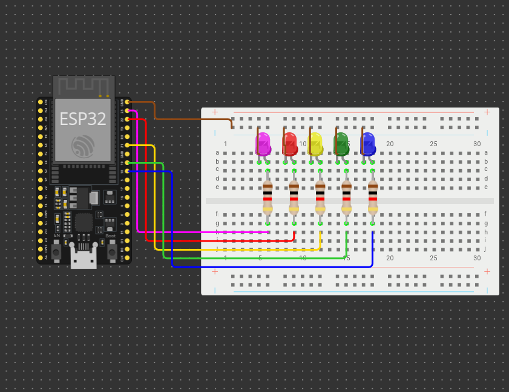

# finger-tracking-led
A Python script that tracks fingertips movement and control ESP32 and LEDs via serial communication

Hoream ngajieun readmena, engke we atuh, keur lieur

### btw ieu demo-na

### Sareung ieu rangkaianna
