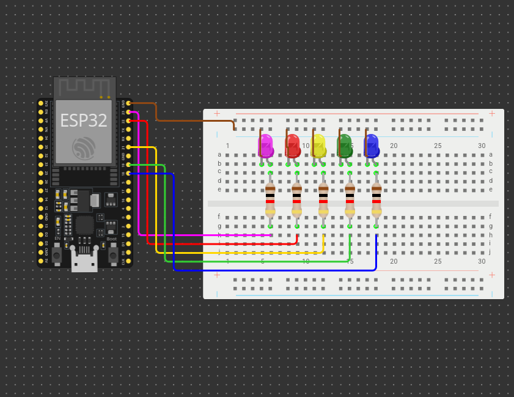

# Finger Tracking LED Controller

A real-time finger gesture tracking system that uses computer vision and machine learning to detect active fingers and control LEDs for PWM voltages with ESP32.

> **⚠️ Caution**: This project is designed for educational and hobbyist purposes. Ensure proper safety measures when working with electronics.


## Overview

This project combines Python-based computer vision with ESP32 hardware control to create a response finger gesture tracking system. The system detects distance between wrist and fingertips (with Euclidean length), calculate the distance, and change them to PWM values, and sends PWM signals to LEDs that physically follow your gestures. 

## Features

- **Real-time Tracking:** Low-latency finger gesture detection using OpenCV (Camera input) and Mediapipe.
- **Eudclidean Length Calculation:** Calculate precise 2D distances between the wirst and fingertips then change them to PWM output.
- **Optimized Scaling:** Uses dynamic palm-size referencing to create depth-independent ratios, ensuring consistent PWM output.
- **Optimized Data Transfer:** 115200 baud serial and throttled serial connection to prevent hardware buffer overload.
- **Visual Feedback:** Live video feed with angle measurements and FPS counter.

## Hardware Requirements




| Components/Tools                       | Qty. |
| -------------------------------------- | ---- |
| ESP32 board                            | 1    |
| Resistor (220 ohm to 330 ohm)          | 5    |
| LED (any color)                        | 5    |
| USB cable for ESP32 connection         | 1    |
| Webcam                                 | 1    |
| Jumper cable (depends on your circuit) | -    |

### Wiring

| Finger | ESP32 Pin to LED Anode | LED   | from LED Cathode to ESP32 Pin |
| ------ | ---------------------- | ----- | ----------------------------- |
| Thumb  | GPIO 23                | LED 1 | GND                           |
| Index  | GPIO 22                | LED 2 | GND                           |
| Middle | GPIO 21                | LED 3 | GND                           |
| Ring   | GPIO 19                | LED 4 | GND                           |
| Pinky  | GPIO 18                | LED 5 | GND                           |

## Installation

1. Clone the Repository
```bash
git clone https://github.com/nisyk/finger-tracking-led.git
cd finger-tracking-led
```

2. Install Python Dependencies
_System Requriements:_ Python 3.8-3.10 (3.10 recommended)
```bash
pip install -r requirements.txt
```

**Required libraries:**
- `opencv-python`
- `mediapipe`
- `pyserial`
- `numpy`
- `protobuf`

3. Open `arduino_code.ino` in Arduino IDE
4. Select your board type and port
5. Click Upload ➡️

#### Check Serial Port

Edit the serial port in `main.py`

**Linux:**

```python
arduino = serial.Serial(port='/dev/ttyUSB0', baudrate=115200, timeout=0.1)
```

Check available ports:

```bash
ls /dev/ttyUSB* /dev/ttyACM*
```

**Windows:**

```python
arduino = serial.Serial(port='COM3', baudrate=115200, timeout=0.1)
```

Check Device Manager -> Ports (COM)

**macOS:**

```python
arduino = serial.Serial(port='/dev/cu.usbmodem14201', baudrate=115200, timeout=0.1)
```

Check available ports:
```bash
ls /dev/cu*
```

## Usage

1. Ensure your ESP32 is connected via USB
2. Run the Python script:
```bash
python main.py
```

3. Position your palm in front of the webcam
4. The LEDs should track your finger gestures
5. Press **'q'** to quit

## Configuration

**Adjusting smoothing factor:** In `main.py` modify the `alpha` value like this:
```python
alpha = 0.3
```
> *Note:*
>  - Lower values (0.1 - 0.2): Smoother rate of change, more slower response (lag)
>  - Higher value (0.7 - 0.9): Faster but rough rate of change

**Adjusting ESP32/LED pins:** In `arduino_code.ino`, modify the ESP32/LED pins configuration
```c
const int ledPins[5] = {23, 22, 21, 19, 18};
```
> *Note*
> Please check ESP32 documentations for picking the right pins.


## Troubleshooting

**ESP32 not detected**
- Check USB connection
- Verify wiring connections
- [Check your Serial Port](#check%20serial%20port)
- Try a different USB cable
- Check permission on Linux
```bash
sudo usermod -aG dialout $USER
```

**Webcam not working**
- Change camera index in `main.py` line 18: `cap = cv2.VideoCapture(1)`
- Check camera permissions

**Rough LED response**
- Decrease `alpha` value for more smoothing
- Ensure good lighting conditions
- Keep hand steady and centered in frame

**LEDs not responding**
- Verify correct wiring and pin configuration
- Check LED polarity
- Test LEDs individually with a simple blink sketch
- Verify baud rate matches (115200) in both scripts

**No Hand Detection**
- Ensure adequate lighting
- Position your hand clearly in frame

---
Made with curious by 🌆 **NISY**